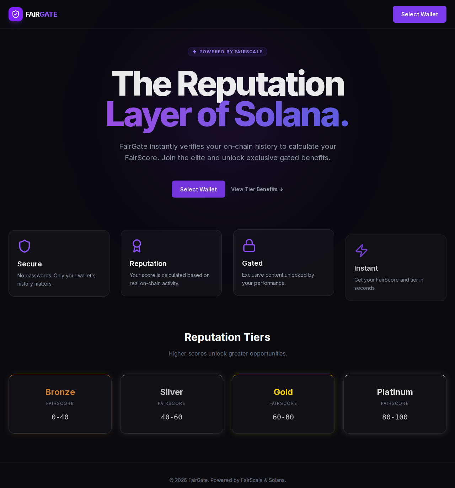

# FairGate

**Prove Your Reputation. Unlock Your Access.**

FairGate is a production-ready reputation gateway built for the Solana ecosystem. It leverages [FairScale's](https://fairscale.xyz) infrastructure to analyze on-chain activity and social presence, generating a verifiable "FairScore" that grants users access to tiered content, communities, and alpha.

## 🚀 Live Demo
[https://superteam-fairgate.vercel.app](https://superteam-fairgate.vercel.app)

> **No wallet? No problem.** Try the full dashboard experience at [/demo](https://superteam-fairgate.vercel.app/demo) — no wallet connection needed.



## ✨ Features
- **Instant Reputation Scoring**: Connect your wallet to receive an immediate FairScore (0-100).
- **Tiered Access Control**: Content is dynamically gated based on your reputation tier (Bronze, Silver, Gold, Platinum).
- **Rich Activity Insights**: View detailed breakdowns of your transaction history, wallet age, and asset holdings.
- **Proof of Action Badges**: Unlock specific badges for being a "Diamond Hands" holder, "DeFi Native", or "LST Staker".
- **Score Breakdown**: Visualize how your FairScore is composed — on-chain activity vs social reputation, with animated progress bars.
- **Responsive & Dark-First UI**: Polished, mobile-friendly interface designed for the Solana community.

## 🛠️ FairScale Integration
FairGate integrates the FairScale API server-side to ensure security and prevent manipulation.
- **Data Fetching**: The app calls `/api/score` which proxies requests to FairScale's engine with a protected API key.
- **Reputation Logic**: Scores are used to determine user tiers and unlock specific UI components.
- **Privacy First**: Analysis is performed on-chain; no personal data is stored by FairGate.
- **Full Response Mapping**: Parses `fairscore`, `fairscore_base`, `social_score`, `tier`, `badges`, and `features` from the API response.

## 🏗️ Tech Stack
- **Framework**: [Next.js 14](https://nextjs.org/) (App Router)
- **Styling**: [Tailwind CSS](https://tailwindcss.com/)
- **Animations**: [Framer Motion](https://www.framer.com/motion/)
- **Blockchain**: [@solana/web3.js](https://solana-labs.github.io/solana-web3.js/) & [@solana/wallet-adapter](https://github.com/solana-labs/wallet-adapter)
- **Icons**: [Lucide React](https://lucide.dev/)

## 💻 Local Setup

1. **Clone the repository**
   ```bash
   git clone https://github.com/fffwaves/superteam-fairgate.git
   cd superteam-fairgate
   ```

2. **Install dependencies**
   ```bash
   npm install
   ```

3. **Configure Environment**
   Create a `.env.local` file in the root:
   ```env
   FAIRSCALE_API_KEY=your_api_key_here
   ```

4. **Run Development Server**
   ```bash
   npm run dev
   ```
   Open [http://localhost:3000](http://localhost:3000) to see the app.

## 🛡️ License
Distributed under the MIT License. See `LICENSE` for more information.

---
Built for the **Superteam Earn** FairScale Bounty.
